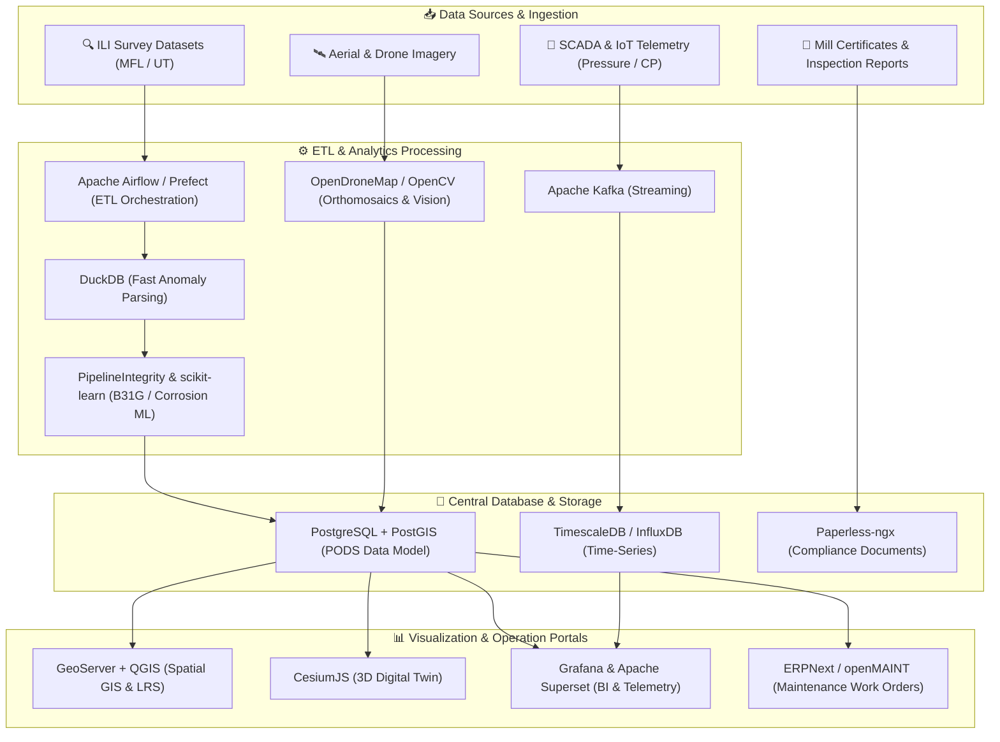

# Awesome Pipeline Integrity Management 🌐🛡️

  

  <b>A curated list of Enterprise SaaS platforms, Open-Source software, digital twin frameworks, and engineering tools for Pipeline Integrity Management (PIM), Inline Inspection (ILI), Corrosion Prediction, GIS Linear Referencing, Cathodic Protection, and Asset Reliability Engineering.</b>

---

## 📑 Table of Contents
- [📖 Overview &amp; Industry Scope](#-overview--industry-scope)
- [🏢 SaaS &amp; Enterprise Hosted Platforms](#-saas--enterprise-hosted-platforms)
- [💻 Open-Source GitHub Projects](#-open-source-github-projects)
  - [🧮 Integrity Calculations &amp; Machine Learning](#-integrity-calculations--machine-learning)
  - [🗺️ GIS, Mapping &amp; Spatial Databases](#️-gis-mapping--spatial-databases)
  - [⚙️ Asset Management &amp; CMMS Platforms](#️-asset-management--cmms-platforms)
  - [📡 IoT, Condition Monitoring &amp; Digital Twins](#-iot-condition-monitoring--digital-twins)
  - [🔄 Data Integration &amp; Orchestration Pipelines](#-data-integration--orchestration-pipelines)
  - [📊 Analytics, BI &amp; Visualization Dashboards](#-analytics-bi--visualization-dashboards)
  - [📁 Document Management &amp; Regulatory Evidence](#-document-management--regulatory-evidence)
  - [🛰️ Computer Vision &amp; Remote Sensing](#️-computer-vision--remote-sensing)
- [🏗️ Blueprint: Building an Open-Source PIM Architecture](#️-blueprint-building-an-open-source-pim-architecture)
- [🤝 How to Contribute](#-how-to-contribute)
- [📈 Star History](#-star-history)
- [⚠️ Disclaimer](#️-disclaimer)

---

## 📖 Overview & Industry Scope

The **Pipeline Integrity Management (PIM)** ecosystem encompasses software, hardware, and analytical tools designed to ensure the structural soundness, operational safety, and regulatory compliance (e.g., API 1160, ASME B31.8S, 49 CFR Part 192/195) of oil, gas, chemical, hydrogen, and water pipeline networks throughout their lifecycle.

### 🎯 Key Functional Capabilities:
- 🔍 **Inline Inspection (ILI) & NDT Analytics**: High-resolution ultrasonic (UT), magnetic flux leakage (MFL), and acoustic resonance defect sizing, anomaly clustering, and feature matching.
- 🛡️ **Corrosion & Cathodic Protection**: Internal/external corrosion growth modeling, ASME B31G / Modified B31G / RSTRENG fitness-for-service (FFS) calculations, and close interval survey (CIS) analysis.
- 🗺️ **GIS & Linear Referencing (LRS)**: Dynamic segmentation, stationing, pipeline alignment sheets, crossing management, and High Consequence Area (HCA) spatial classification.
- 📈 **Quantitative Risk Assessment (QRA)**: Risk scoring, failure probability calculation, consequence modeling, threat interaction matrix, and mitigation prioritisation.
- 🌐 **Predictive Maintenance & Digital Twins**: Real-time SCADA sensor telemetry, IoT edge processing, pressure cycle fatigue analysis, and 3D geospatial infrastructure simulation.

---

## 🏢 SaaS & Enterprise Hosted Platforms

> [!NOTE]
> **Market Size & Sector Structure**: The global Pipeline Integrity Management market is estimated at **$10.8 Billion in 2026** (projected to reach **$16.2 Billion by 2032** at a ~6.8% CAGR). The sector is **moderately fragmented**: mega-cap enterprise software conglomerates (SAP, IBM, Hexagon, AVEVA) dominate broad asset lifecycle management and digital twins, while highly specialized niche providers (ROSEN, DNV, NDT Global, OneSoft) capture specialized inline inspection (ILI) analytics, proprietary crack detection, and regulatory compliance modeling.

The table below is sorted by **Company Scale / Valuation / Revenue (Descending)**:

| Platform | Company Scale / Valuation / Revenue | Description | Starting Tier Pricing | Free Tier / Trial Limits |
| :--- | :--- | :--- | :--- | :--- |
| **[SAP Asset Performance Management](https://www.sap.com/products/scm/asset-performance-management.html)** | **~$280B Market Cap** (SAP SE, ~$35B+ Ann. Rev) | Enterprise asset-performance platform supporting predictive maintenance, reliability-centered maintenance, asset health, and deep S/4HANA integration. | Cloud subscription via SAP BTP starting at ~$2,500/month (consumption-based / CPEA model) | 90-day SAP BTP trial account (limited non-commercial testing with sample dataset) |
| **[IBM Maximo Application Suite](https://www.ibm.com/products/maximo)** | **~$210B Market Cap** (IBM Corp, ~$62B Ann. Rev) | Industry-standard enterprise asset-management and CMMS suite supporting pipeline lifecycle tracking, work orders, AI predictive maintenance, and field reliability. | Essentials SaaS tier starts at ~$3,150/month (AppPoints credit-based consumption model) | 14-day free trial (cloud-hosted sandbox with pre-loaded sample data for Maximo Manage & Maximo Health) |
| **[Enbridge Asset Management Systems](https://www.enbridge.com/)** | **~$80B Market Cap** (Enbridge Inc, ~$35B Ann. Rev) | Enterprise pipeline and energy infrastructure asset-management capabilities supporting complex operational assets, maintenance, integrity, and compliance workflows. | Enterprise proprietary platform / licensed industry solutions starting at enterprise scope | Proprietary operator system; partner and supplier portal access only upon agreement |
| **[Hexagon SDx (HxGN SDx2)](https://hexagon.com/products/hxgn-sdx)** | **~$30B Market Cap** (Hexagon AB, ~$5.5B Ann. Rev) | Enterprise asset-information and digital-twin platform managing engineering data, tag-to-document relationships, inspection records, and facility operational history. | Enterprise SaaS tier starts at ~$2,000/month (module and user-seat dependent) | No self-service free tier; interactive live demo and digital twin sandbox session upon request |
| **[IFS Cloud EAM](https://www.ifs.com/solutions/enterprise-asset-management)** | **~$12B Valuation** (IFS AB, ~$1.2B Ann. Rev) | Industrial enterprise asset-management platform for asset-intensive infrastructure, predictive maintenance planning, reliability, and field service management. | Task/Light user tier starts at ~$50–$80/user/month; Full user tier starts at ~$110–$200/user/month | No self-service free tier; guided evaluation demo and proof of concept available upon request |
| **[AVEVA Asset Information Management](https://www.aveva.com/en/products/asset-information-management/)** | **~$11B Valuation** (Schneider Electric Group) | Industrial information management platform aggregating engineering data, 1D/2D/3D models, inspection history, and digital twins for pipeline assets. | AVEVA Flex subscription credit model starting at ~$15,000/year entry package | No self-service free tier; trial access provided during guided technical proof-of-concept |
| **[Esri ArcGIS Utility Network](https://www.esri.com/en-us/arcgis/products/arcgis-utility-network)** | **~$8B Valuation** (Esri Inc, ~$1.8B+ Ann. Rev) | Industry-standard enterprise GIS platform for modeling connected pipeline infrastructure, linear referencing, network topology, spatial assets, and geospatial risk. | ArcGIS Online Creator user type starts at $550/user/year; Advanced Editing extension for Utility Network starts at ~$1,000/user/year | 21-day free trial (up to 5 named users, 400 service credits, full non-production functionality) |
| **[Bentley AssetWise](https://www.bentley.com/software/assetwise-asset-reliability/)** | **~$6B Market Cap** (Bentley Systems, ~$1.2B Ann. Rev) | Infrastructure asset-management and engineering information platform supporting linear pipeline assets, condition monitoring, compliance, and lifecycle records. | Cloud Services Subscription (CSS) / Passport licensing starting at ~$1,200/user/year | No self-service free tier; guided proof-of-concept trial via Bentley account representative |
| **[DNV Synergi Pipeline](https://www.dnv.com/services/pipeline-integrity-management-software-synergi-pipeline-1834/)** | **~$3.2B Valuation** (DNV Group, ~$3B Ann. Rev) | Comprehensive pipeline integrity, risk-management, and simulation platform supporting ILI data, risk modeling, regulatory compliance, and hydraulic simulation. | Synergi Life Starter Pack starts at €7,000/year (5 users); Synergi Pipeline Simulator 7-day access starts at €2,250/user | Synergi Life free trial starter pack available upon request; SPS provides 7-day short-term evaluation access |
| **[ROSEN Integrity Solutions (NIMA)](https://www.rosen-group.com/)** | **~$1.5B Valuation** (ROSEN Group, ~$700M+ Ann. Rev) | Specialized pipeline integrity software framework and services for ILI data management, crack/corrosion assessment, and integrity planning. | Modular SaaS framework starting at ~$10,000/year base tier (scaled by pipeline mileage) | No self-service free tier; 30-minute standard guided demo and sample dataset review upon request |
| **[Quorum Pipeline Management](https://www.quorumsoftware.com/)** | **~$1.2B Valuation** (Thoma Bravo portfolio, ~$300M Ann. Rev) | Energy-industry software suite supporting pipeline operations, commercial workflows, transportation management, asset information, and operational processes. | Software suite starting at ~$10,000/year (module and pipeline throughput/mileage based) | No self-service free tier; customized live operational demo available upon request |
| **[NDT Global](https://www.ndt-global.com/)** | **~$500M Valuation** (Previan Group) | High-resolution ultrasonic and acoustic inline inspection data management, defect analysis, and pipeline integrity engineering services. | Inspection and reporting service tiers starting at ~$15,000 per inspection campaign | No self-service free tier; sample ILI diagnostic dataset and reporting demo upon request |
| **[OneSoft (Cognitive Integrity Management - CIM)](https://onesoftsolutions.com/)** | **~$150M Market Cap** (OneSoft Solutions Inc.) | SaaS cloud platform utilizing machine learning, linear referencing, and ILI analytics for pipeline defect tracking, corrosion growth modeling, and integrity compliance. | SaaS subscription starting at ~$1,500/month (or ~$15–$25 per pipeline mile/year) | No self-service free tier; structured pilot evaluation and guided demo available upon request |
| **[Asset Guardian Solutions](https://www.assetguardian.com/)** | **~$40M Valuation** | Enterprise asset-management and industrial automation change-management platform securing PLC/SCADA software, pipeline asset records, and maintenance logs. | Annual enterprise subscription starting at ~$8,000/year | No self-service free tier; live guided demo and environment walkthrough upon request |
| **[Asset Integrity Engineering (VAIL-Plant)](https://www.aiegroup.org/vail-plant-software/)** | **~$35M Valuation** | Specialized pipeline and plant integrity management software supporting cathodic protection, pipeline risk assessment, defect logging, and inspection scheduling. | VAIL-Plant module license starts at ~$20,000 (one-time license / annual SaaS tier) | No self-service free tier; guided technical demo and sample dataset evaluation available upon request |
| **[Inspectahire](https://www.inspectahire.com/)** | **~$25M Valuation** | Specialist inspection, remote visual inspection (RVI), and field services platform supporting workforce coordination, reporting, and asset records. | Inspection service and equipment rental tiers starting on custom project scope | No self-service free tier; technical scoping consultation and quotation upon request |
| **[Orbital Eye (CoSMiC-EYE)](https://www.orbitaleye.nl/)** | **~$20M Valuation** | Geospatial satellite Earth observation platform providing continuous right-of-way surveillance, third-party interference detection, and geo-hazard monitoring for pipelines. | Right-of-way satellite surveillance starting at ~€300–€500 per pipeline km/year | No self-service free tier; sample satellite surveillance pilot and demo upon request |
| **[Pipeline360 / PipelineManager](https://www.integrate.com/pipeline360)** | **~$15M Valuation** | Pipeline operations, construction monitoring, field data collection, and asset tracking management platform. | Operational tier starting at ~$5,000/year | No self-service free tier; vendor-guided demo and consultation available upon request |

---

## 💻 Open-Source GitHub Projects

All open-source repositories below are categorized and sorted by **GitHub_Stars (Descending)**. Star badges link directly to each repository's stargazers page:

### 🧮 Integrity Calculations & Machine Learning

- **[PyTorch](https://github.com/pytorch/pytorch)**  — Foundational machine learning framework widely used for acoustic emission signal processing, ILI sensor defect detection, computer vision, and predictive maintenance research.
- **[scikit-learn](https://github.com/scikit-learn/scikit-learn)**  — Industry-standard machine-learning library useful for anomaly detection, corrosion growth rate regression, pipeline failure risk modeling, and inspection prioritization.
- **[XGBoost](https://github.com/dmlc/xgboost)**  — High-performance gradient boosting framework optimized for predicting internal/external corrosion depth, remaining useful life (RUL), and soil corrosivity classification.
- **[PipelineIntegrity](https://github.com/chrisk314/PipelineIntegrity)**  — Dedicated Python library for calculating the degree of danger associated with pipeline metal-loss defects using the ASME B31G, Modified B31G, and RSTRENG assessment methods.
- **[Predict-External-Corrosion](https://github.com/joshua-adeyemi/Predict-External-Corrosion-on-Oil-and-Gas-Pipelines)**  — Machine learning models demonstrating predictive assessment of external corrosion depth on oil & gas pipelines from soil properties and operational parameters.
- **[GIAMS](https://github.com/GIAMS-Group/GIAMS)**  — General Infrastructure Asset Management System providing an open-source framework for modeling condition states, deterioration curves, and lifecycle maintenance optimization.

### 🗺️ GIS, Mapping & Spatial Databases

- **[Leaflet](https://github.com/Leaflet/Leaflet)**  — Lightweight, mobile-friendly JavaScript mapping library ideal for building high-speed web dashboards displaying pipeline routes, valve stations, and inspection markers.
- **[CesiumJS](https://github.com/CesiumGS/cesium)**  — Open-source 3D geospatial engine for rendering 3D digital twins, terrain elevation profiles, subterranean pipeline centerlines, and drone survey point clouds.
- **[OpenLayers](https://github.com/openlayers/openlayers)**  — High-performance mapping engine for displaying vector tiles, raster layers, and OGC web services for linear infrastructure management.
- **[QGIS](https://github.com/qgis/QGIS)**  — Comprehensive desktop Geographic Information System (GIS) for pipeline alignment sheets, right-of-way environmental analysis, cathodic protection overlays, and spatial defect mapping.
- **[GDAL](https://github.com/OSGeo/gdal)**  — Foundational geospatial data abstraction library for translating and converting vector and raster pipeline spatial data formats (Shapefiles, GeoJSON, DEMs, GeoTIFFs).
- **[GeoServer](https://github.com/geoserver/geoserver)**  — Open-source server for publishing pipeline geospatial layers, High Consequence Areas (HCAs), and environmental constraints via standard WMS, WFS, and WCS protocols.
- **[PostGIS](https://github.com/postgis/postgis)**  — Powerful spatial database extender for PostgreSQL providing linear referencing system (LRS) functions, distance queries, and buffer analysis for pipeline centerlines and anomalies.
- **[pgRouting](https://github.com/pgRouting/pgrouting)**  — Routing and network analysis library for PostGIS enabling connectivity modeling, flow direction analysis, and isolated segment determination in pipeline networks.
- **[GeoNode](https://github.com/GeoNode/geonode)**  — Web-based geospatial content management system for creating collaborative spatial data portals and sharing pipeline GIS data across departments.
- **[GRASS GIS](https://github.com/OSGeo/grass)**  — Advanced geospatial analysis suite supporting geomorphological analysis, landslide hazard assessment along pipeline routes, and hydrological catchment modeling.
- **[MapStore](https://github.com/geosolutions-it/mapstore2)**  — Highly configurable WebGIS platform for building custom enterprise mapping portals, dashboarding spatial integrity data, and integrating geospatial services.

### ⚙️ Asset Management & CMMS Platforms

- **[Odoo Community](https://github.com/odoo/odoo)**  — Extensible open-source enterprise suite featuring maintenance work orders, spare parts inventory, equipment hierarchies, and field service workflows adaptable for pipeline operations.
- **[Snipe-IT](https://github.com/snipe/snipe-it)**  — Open-source asset tracking and inventory management software for tracking instrumentation, cathodic protection rectifiers, test posts, and inspection tools.
- **[ERPNext](https://github.com/frappe/erpnext)**  — Full-featured enterprise management system with native asset maintenance schedules, purchase orders, vendor contracts, and engineering project management.
- **[OpenProject](https://github.com/opf/openproject)**  — Project and portfolio management platform for managing pipeline dig campaigns, integrity assessment projects, hydrostatic re-testing, and compliance milestones.
- **[InvenTree](https://github.com/inventree/InvenTree)**  — Lightweight, intuitive inventory and component tracking system designed for spare valves, sleeves, flanges, sacrificial anodes, and maintenance stock.
- **[GLPI](https://github.com/glpi-project/glpi)**  — Open-source service desk and asset management software for managing defect ticketing, field repair work orders, and maintenance schedules.
- **[CMDBuild](https://github.com/cmdbuild/cmdbuild)**  — Configurable low-code asset database and workflow engine for modeling complex pipeline asset topologies, valve stations, pump units, and inspection records.
- **[openMAINT](https://www.openmaint.org/)**  — Enterprise CMMS built on CMDBuild tailored for linear infrastructure, preventive maintenance calendars, GIS asset location, and breakdown repairs.
- **[Atlas CMMS / Grash](https://github.com/grash-hq/grash)**  — Modern open-source maintenance management system supporting mobile checklists, technician work order dispatching, and asset telemetry logging.

### 📡 IoT, Condition Monitoring & Digital Twins

- **[Node-RED](https://github.com/node-red/node-red)**  — Low-code visual flow-based programming tool for connecting SCADA telemetry, MQTT pipeline pressure sensors, cathodic protection dataloggers, and alert systems.
- **[ThingsBoard](https://github.com/thingsboard/thingsboard)**  — Industrial IoT platform for data collection, telemetry processing, device management, and real-time visualization of pipeline pressure, flow, and CP voltages.
- **[InfluxDB](https://github.com/influxdata/influxdb)**  — High-throughput time-series database optimized for storing millions of sensor data points from acoustic leak detection systems and cathodic protection dataloggers.
- **[TimescaleDB](https://github.com/timescale/timescaledb)**  — PostgreSQL extension designed for high-performance time-series queries, ideal for historical pressure cycle fatigue analysis and corrosion sensor logging.
- **[FIWARE Context Broker](https://github.com/FIWARE/context.Orion-LD)**  — NGSI-LD compliant context information broker for managing dynamic digital twin states, operational alerts, and sensor federation across linear assets.
- **[Eclipse Ditto](https://github.com/eclipse-ditto/ditto)**  — Open-source digital-twin framework creating stateful digital mirrors of physical pipeline valves, pumps, compressors, and sensor devices via unified APIs.
- **[OpenRemote](https://github.com/openremote/openremote)**  — Professional open-source IoT automation platform for asset monitoring, rule engine automation, geographic asset tracking, and condition monitoring.

### 🔄 Data Integration & Orchestration Pipelines

- **[PostgreSQL](https://github.com/postgres/postgres)**  — World's most advanced open-source relational database, serving as the core storage engine for pipeline attribute data, inspection findings, and integrity records.
- **[Apache Kafka](https://github.com/apache/kafka)**  — High-throughput distributed event streaming platform for real-time SCADA sensor telemetry, leak detection alerts, and operational event ingestion.
- **[Apache Airflow](https://github.com/apache/airflow)**  — Workflow orchestration engine for scheduling automated ILI data ingestion pipelines, corrosion growth batch calculations, GIS syncing, and compliance report generation.
- **[DuckDB](https://github.com/duckdb/duckdb)**  — Fast in-process analytical SQL engine for rapidly parsing, querying, and aggregating millions of raw ILI sensor anomalies and metal-loss defect records.
- **[Prefect](https://github.com/PrefectHQ/prefect)**  — Modern workflow orchestration and ETL tool for orchestrating engineering calculations, sensor validation pipelines, and data sync tasks.
- **[dbt Core](https://github.com/dbt-labs/dbt-core)**  — Data build tool for modular transformation, data modeling, and testing of pipeline integrity databases in compliance with PODS schemas.
- **[Great Expectations](https://github.com/great-expectations/great_expectations)**  — Automated data validation framework ensuring that incoming ILI survey files, vendor inspection logs, and sensor streams adhere strictly to format specifications.
- **[Pandera](https://github.com/unionai-oss/pandera)**  — Lightweight, type-safe schema validation library for Python dataframes used in corrosion modeling and defect assessment workflows.
- **[Apache NiFi](https://github.com/apache/nifi)**  — Robust graphical dataflow automation platform for secure ingestion and transformation of operational data between SCADA, enterprise systems, and data lakes.
- **[Meltano](https://github.com/meltano/meltano)**  — Declarative, Singer-based ELT platform for extracting asset, maintenance, and sensor data from legacy databases into central integrity data warehouses.
- **[PODS Open Data Standard](https://www.pods.org/)** — Industry standard pipeline data model providing architectural schemas for storing pipeline assets, ILI inspections, cathodic protection, and geospatial records.

### 📊 Analytics, BI & Visualization Dashboards

- **[Grafana](https://github.com/grafana/grafana)**  — Industry-leading analytics and dashboard platform for real-time condition monitoring, corrosion rate trends, pressure cycle histograms, and KPI tracking.
- **[Apache Superset](https://github.com/apache/superset)**  — Modern, enterprise-ready business intelligence web application for building interactive integrity charts, risk matrices, and defect density visualizations.
- **[Metabase](https://github.com/metabase/metabase)**  — User-friendly BI and self-service analytics tool for non-technical integrity managers to explore repair histories and inspection findings.

### 📁 Document Management & Regulatory Evidence

- **[Paperless-ngx](https://github.com/paperless-ngx/paperless-ngx)**  — Modern document management system with OCR and automated tagging for digitizing pipeline mill test certificates, weld X-ray records, and inspection reports.
- **[Mayan EDMS](https://gitlab.com/mayan-edms/mayan-edms)**  — Enterprise electronic document management system offering fine-grained access control and cryptographic checksums for audit-proof regulatory compliance records.
- **[OpenKM Community](https://github.com/openkm/document-management-system)**  — Document management system providing version tracking, metadata extraction, and workflow automation for engineering drawings and repair records.

### 🛰️ Computer Vision & Remote Sensing

- **[OpenCV](https://github.com/opencv/opencv)**  — Leading computer vision library for analyzing right-of-way aerial imagery, detecting third-party construction encroachment, and automated coating defect visual inspection.
- **[CVAT](https://github.com/cvat-ai/cvat)**  — Powerful web-based annotation platform for labeling pipeline inspection videos, drone imagery, and defect photography for training computer vision models.
- **[OpenDroneMap (ODM)](https://github.com/OpenDroneMap/ODM)**  — Photogrammetry suite for generating orthomosaic maps, 3D surface models, and elevation maps from drone aerial surveys along pipeline right-of-ways.
- **[FreeCAD](https://github.com/FreeCAD/FreeCAD)**  — Parametric 3D CAD modeler for engineering design of pipeline repair sleeves, hot-tap clamps, flange assemblies, and pig traps.
- **[Blender](https://github.com/blender/blender)**  — Open-source 3D creation suite for rendering high-fidelity digital twin visualizations, pigging tool animations, and subsea pipeline topologies.

---

## 🏗️ Blueprint: Building an Open-Source PIM Architecture

---

## 🤝 How to Contribute

Contributions to expand and refine this ecosystem are very welcome! 

1. 🍴 **Fork the repository** on GitHub.
2. 🌿 **Create a new branch** (`git checkout -b feature/add-new-tool`).
3. 📝 **Add your entry** to the appropriate category in [`README.md`](README.md).
   - Ensure the description is factual, concise, and linked to the official site or repository.
   - For SaaS tools: include starting tier pricing and free trial details.
   - For Open-Source tools: include a social-style star badge linked to stargazers.
4. 🚀 **Commit your changes** (`git commit -m "Add NewTool to Open-Source GIS section"`).
5. 📤 **Push to your branch** (`git push origin feature/add-new-tool`).
6. 🔀 **Open a Pull Request** with a brief summary of the added tools.

---

## 📈 Star History

---

## ⚠️ Disclaimer

This repository is a community-curated educational and technical resource—not an endorsement. Pipeline integrity decisions involve safety-critical engineering, environmental protection, public safety, and regulatory compliance. Open-source libraries and algorithms should not substitute for certified engineering review, validated pipeline integrity management programs, or applicable statutory requirements.
